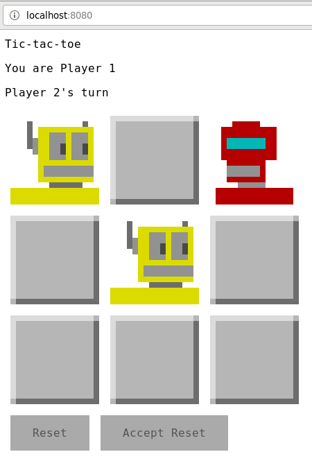

Tic-tac-toe 
===========

LAN multiplayer tic-tac-toe client/server in scala using http4s & scala.js



Status
------

WIP.  Server initial implementation.
Server testing in progress.
Basic client layout and gui.
Client main loop missing.
Shared code fully tested.
No client tests yet.

Run it!
-------

```
sbt client/fullOptJS
bash copy.sh
sbt server/assembly
java -jar server/target/scala-2.12/server-assembly-x.x.x.jar
```

Open `localhost:8080/` in browser.
Then have your friend (assuming you have friends) open `<your ip>:8080/` in their browser.
If you have no friends, open an incognito browser window to play against yourself.

Notes
-----

Game States
- Init
- Player1Ready
- Player2Ready
- Player1Turn
- Player2Turn
- GameOver
- Reset
- Quit

Endpoints:
- GET /
    - sets cookie id (determines player 1 vs player 2) & returns html
- GET /js/file
    - returns static javascript
- GET /img/file
    - returns static png files
- GET /status
    - returns status string
- POST /play/index
    - current player takes her turn; returns status string
- POST /reset
    - when in GameOver state, either player can request a new game
- POST /accept-reset
    - when in reset state, accept to move to PlayerXTurn
- POST /quit
    - when in GameOver or Reset state, a player can quit
- POST /acknowledge-quit
    - when in Quit state, accept to move to PlayerXReady

Status string: 12 characters with format PSSCCCCCCCCC where
- P: Player
    - 1: Player1
    - 2: Player2
    - S: Spectator
- SS: Game state
    - IN: Init
    - R1: Player1Ready
    - R2: Player2Ready
    - T1: Player1Turn
    - T2: Player2Turn
    - G1: GameOver; player 1 wins
    - G2: GameOver; player 2 wins
    - GS: GameOver; it's a tie
    - Q1: Quit player 1
    - Q2: Quit player 2
    - X1: Reset player 1
    - X2: Reset player 2
- C: Board Cell
    - E: Empty
    - X: player 1 has an X here
    - O: player 2 has an O here


TODO
----

- Shared models
    - GameOver(Ending, board) to express tie (Ending is p1Win, p2Win or tie)
    - Test coverage Player
    - Test coverage Game
    - update shared models for reset & quit
        - Reset(Player)
        - Quit(Player)
- get root when Player2Ready
- Write all server endpoint tests
- Bad requests/forbidden should return 400 (bad request) 403 (forbidden)
    - POST play with index out of bounds
    - POST play with index not empty cell
    - Player1 trying to POST play on Player2's turn
    - Player trying to POST play in wrong game state
    - POST reset when not game over
- could add reset
    - client: reset button appears on GameOver that POSTs to reset endpoint
    - puts game in reset (1 or 2) state (waiting for other player to accept, or quit)
    - after other player accepts, puts game in Player1Turn or Player2Turn state
- could add quit
    - server: a POST quit endpoint
    - client: Quit button appears in GameOver that POSTs to quit endpoint
    - puts game in Quit (1 or 2) state (waiting for remaining player to acknowledge)
    - When player acknowledges, puts game in Player1Ready or Player2Ready state;
      allowing another player to connect and play
