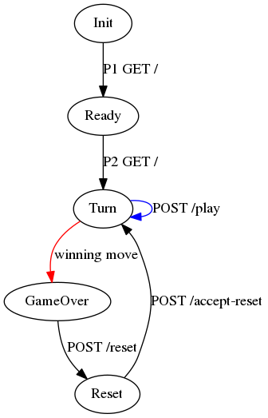

Tic-tac-toe
===========

LAN multiplayer tic-tac-toe client/server in scala using http4s & scala.js

Screenshot:


Run it!
-------

```
sbt build
java -jar server/target/scala-2.12/server-assembly-x.x.x.jar
```

Open `localhost:8080/` in browser.
Then have your friend (assuming you have friends) open `<your ip>:8080/` in their browser.
If you have no friends, open a private/incognito browser window to play against yourself.


Notes
-----

Game States
- Init
- ReadyPlayer1
- Turn
- GameOver
- Reset

Endpoints:
- GET /
    - sets cookie id (determines player 1 vs player 2) & returns html
- GET /js/file
    - returns static javascript
- GET /img/file
    - returns static png files
- GET /status
    - returns status string
- POST /play/index
    - current player takes her turn; returns status string
- POST /reset
    - when in GameOver state, either player can request a new game
- POST /accept-reset
    - when in reset state; next state is Turn

Status string: 12 characters with format PSSCCCCCCCCC where
- P: Player
    - 1: Player1
    - 2: Player2
    - S: Spectator
- SS: Game state
    - IN: Init
    - R1: Ready player 1
    - T1: Turn player 1
    - T2: Turn player 2
    - G1: GameOver; player 1 wins
    - G2: GameOver; player 2 wins
    - GT: GameOver; it's a tie
    - S1: Reset player 1
    - S2: Reset player 2
- C: Board Cell
    - E: Empty
    - X: player 1 has an X here
    - O: player 2 has an O here

Finite State Machine:




TODO
----

- Write all server endpoint tests
- Rewrite client using immutable store architecture
- Maybe bad requests/forbidden should return 400 (bad request) 403 (forbidden)
    - POST play with index out of bounds
    - POST play with index not empty cell
    - Player1 trying to POST play on Player2's turn
    - Player trying to POST play in wrong game state
    - POST reset when not game over
