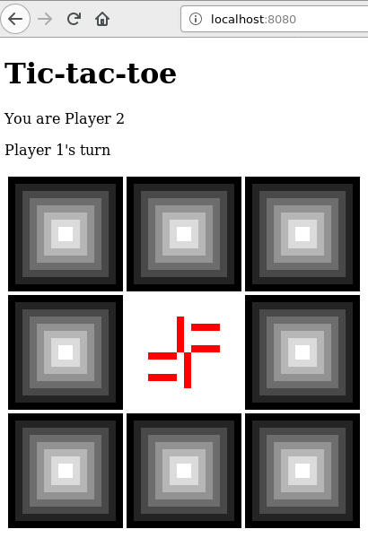

Tic-tac-toe 
===========

tic-tac-toe client/server in scala using http4s & scala.js



Status
------

WIP.  Server initial implementation.
Basic client layout and gui.
Client main loop missing.
Shared code fully tested.
No client or server tests yet.

Run it!
-------

```
sbt client/fullOptJS
bash copy.sh
sbt server/assembly
java -jar server/target/scala-2.12/server-assembly-x.x.x.jar
```

Open `localhost:8080/` in browser.

Notes
-----

Game States
- Init
- Player1Ready
- Player2Ready
- Player1Turn
- Player2Turn
- GameOver

Endpoints:
- GET /
    - sets cookie id (determines player 1 vs player 2) & returns html
- GET /js/file
    - returns static javascript
- GET /img/file
    - returns static png files
- GET /status
    - returns status string
- POST /play/index
    - current player takes her turn; returns status string
- POST /reset
    - when in GameOver state, either player can request a new game

Status string: 12 characters with format PSSCCCCCCCCC where
- P: Player
    - 1: Player1
    - 2: Player2
    - S: Spectator
- SS: Game state
    - IN: Init
    - R1: Player1Ready
    - R2: Player2Ready
    - T1: Player1Turn
    - T2: Player2Turn
    - G1: GameOver; player 1 wins
    - G2: GameOver; player 2 wins
    - GS: GameOver; it's a tie
- C: Board Cell
    - E: Empty
    - X: player 1 has an X here
    - O: player 2 has an O here


TODO
----

- Put game inside an fs2 signal to prevent concurrency bugs and enforce referential transparency.
